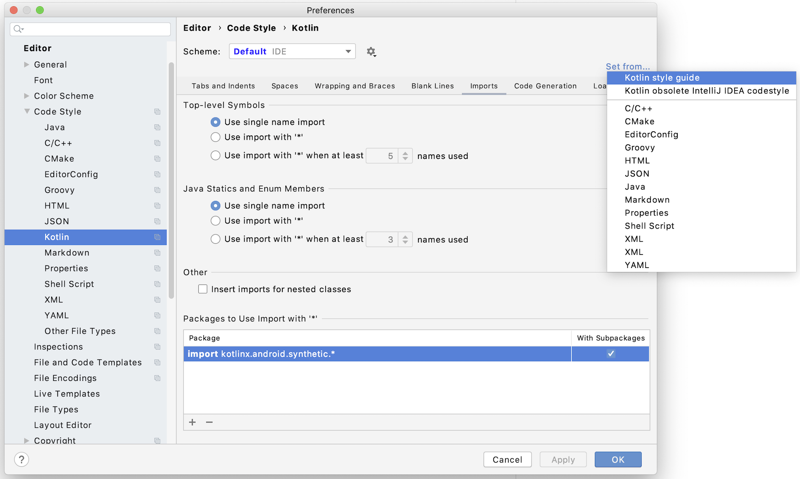

# Общие правила

1. Форматирование кода должно соответствовать [Kotlin Coding Conventions](https://kotlinlang.org/docs/coding-conventions.html). Обратите внимание на пункты, которые не исправляются автоматическим форматированием IDE:
    - [Организация исходного кода](https://kotlinlang.org/docs/coding-conventions.html#source-code-organization) - структура каталогов, пакетов, имена файлов и т.д.
    - [Правила наименований](https://kotlinlang.org/docs/coding-conventions.html#naming-rules) - naming
    - [Правила комментирования](https://kotlinlang.org/docs/coding-conventions.html#documentation-comments)
    - [Избегайте избыточных конструкций](https://kotlinlang.org/docs/coding-conventions.html#avoiding-redundant-constructs)
    - [Идиоматичное применение Kotlin](https://kotlinlang.org/docs/coding-conventions.html#idiomatic-use-of-language-features)

1. Содержимое класса должно быть расположенно в [следующем порядке](https://kotlinlang.org/docs/coding-conventions.html#class-layout):
    - Объявление свойств и блока инициализации
    - Второстепенные конструкторы
    - Объявление методов в порядке сокращения видимости
        - public
        - internal
        - protected
        - private
    - Объект-компаньон
    - Внутренние классы
    - Вложенные классы, интерфейсы, объекты

1. Без необходимости не используйте вложенные классы и интерфейсы:
   - Внутренние ([Inner](https://kotlinlang.org/docs/nested-classes.html)) классы имеет смысл делать только когда в нем необходима ссылка на объект внешнего класса. Такие классы отдельно требуют модификатор **inner**
   - Вложенные ([Nested](https://kotlinlang.org/docs/nested-classes.html)) классы имеет смысл делать только если он логически зависим от внешнего класса и необходимо ограничить видимость (**scope**) такого вложенного класса/интерфейса. Например, интерфейс слушателя событий **EventsListener** логично делать вложенным в класс конкретной вью-модели, реализующей интерфейс [EventsDispatcherOwner](https://github.com/icerockdev/moko-mvvm/blob/master/mvvm-core/src/commonMain/kotlin/dev/icerock/moko/mvvm/dispatcher/EventsDispatcherOwner.kt) для слушателя **EventsListener**. Потому что объекты интерфейса **EventsListener** используются только внутри вью-модели и вне этой конкретной вью-модели такой интерфейс не имеет смысла и нигде использоваться не будет.

1. Выносите утилитарный код в функции верхнего уровня в отдельный файл без создания дополнительных классов или объектов.  

1. Настройте в Android Studio официальный стиль кода для Kotlin, чтобы корректно срабатывало автоматическое форматирование кода ([сочетание клавиш для клавиатуры](https://stackoverflow.com/questions/16580171/code-formatting-shortcuts-in-android-studio-for-operation-systems/16580200#16580200)). Отключите сокращение импортов через звезду **import ***.  

   Помимо включения **Use single name import** важно не упустить пакеты-исключения - они перечислены ниже в разделе **Packages to Use import with *** - оттуда тоже нужно удалить все, кроме котлин синтетиков, но мы их не используем.  

   
